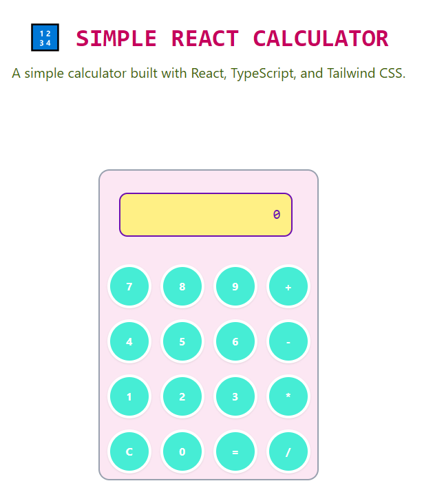

# react-elementary-calculator

> A simple and interactive calculator built using **React**, **TypeScript**, and **Tailwind CSS**.

## Table of contents

- [react-elementary-calculator](#react-elementary-calculator)
  - [Table of contents](#table-of-contents)
  - [General info](#general-info)
  - [Screenshots](#screenshots)
  - [Technologies](#technologies)
  - [Code Examples](#code-examples)
  - [Features](#features)
  - [Status](#status)
  - [Contact](#contact)

## General info

**Elementary Calculator** is a simple and responsive calculator built using **React**, **TypeScript**, and **Tailwind CSS**.  
It uses **mathjs** to perform accurate mathematical computations and supports basic arithmetic operations.  
The application features a clean, modern interface and is optimized for both desktop and mobile use.

## Screenshots



## Technologies

- React
- TypeScript
- Tailwind CSS
- Node.js
- Visual Studio Code

## Code Examples

```js
     {keyboardEl.map((row, index) => (
        <div key={index} className="flex w-full justify-around gap-2 p-2">
          {row.map((key) => (
            <Button handleClick={() => handleClick(key)} key={key}>
              {key}
            </Button>
          ))}
```

## Features

- Basic arithmetic operations:
  - Addition (`+`)
  - Subtraction (`-`)
  - Multiplication (`*`)
  - Division (`/`)
- Clear button to reset the display
- Real-time result display

### To-do list

- Add support for keyboard input
- Improve error handling
- Not using mathjs

## Status

Project is: done

## Contact

By [boba-milktea](https://github.com/boba-milktea)
